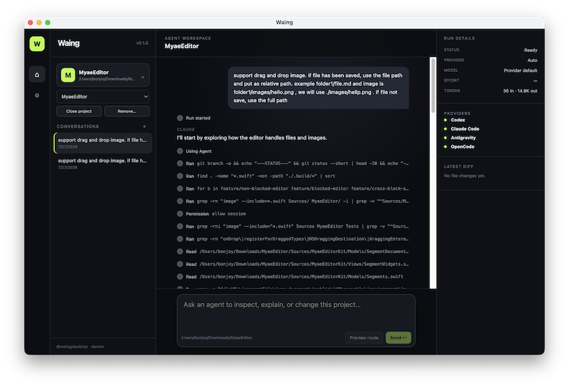

# Waing (ဝိုင်း)

> [!CAUTION]
> Still on development


Waing is a local, provider-neutral Electron workspace for coding agents. You create a roster of agents with distinct
jobs and instructions; a router picks the right agent for each step and decides when the request is complete.

Everything runs on your machine against CLIs you already have installed. Waing never holds provider credentials.



## How a message runs

```
prompt
  ↓
router ─────────────► picks an agent by its "where to use" description
  ↓
agent task ─────────► the selected agent follows its saved instructions
  ↓
router checkpoint ──┬─ another agent ──► router checkpoint
                    ├─ ask user
                    └─ complete
```

The chat transcript shows each stage as it happens: the routing decision, which provider and model took the step,
its messages, tools, file writes, and commands. A Planner, Reviewer, Test Writer, or any user-created specialist can
run in sequence without another prompt.

## Providers (ဝိုင်းတော်သားများ)

| Provider | Transport | Notes |
| --- | --- | --- |
| Codex | `codex app-server --stdio`, JSON-RPC over JSONL | provider thread resume |
| Claude Code | `@anthropic-ai/claude-agent-sdk` | SDK resume identifier |
| Antigravity | `agy --output-format stream-json --print` | conversation id reused across turns; approves its own tool calls (see below) |
| OpenCode | loopback HTTP/SSE, process-scoped basic auth | provider session load; also the default router |

Capabilities are discovered at runtime. A provider that cannot select a model or set reasoning effort simply does
not receive those controls, instead of failing the run.

## Requirements

- Node.js 22+ (`node:sqlite` is required) and npm 11 — npm workspaces only, never pnpm or yarn
- At least one provider CLI on your `PATH`; Settings shows what was detected

## Quick start

```bash
npm install
npm run dev        # Electron + React renderer
```

Open a project folder, then send a message. First launch seeds five starter agents from the providers you actually
have and flags them for review.

## Configuration

Settings is global — it applies to every project:

- Agents — create, edit, reorder, enable, and delete agents; give each a routing description, instructions, provider,
model, reasoning effort, and permission profile. Model choices update after the provider changes. Router controls live here too.
- Provider status — which CLIs were found and their detected versions. Sign-in state is not probed yet.
- Diagnostics — export a redacted diagnostics bundle.

## Commands

```bash
npm run dev          # develop
npm run check        # typecheck + lint + unit tests + build — run before calling a phase done
npm run test:e2e     # Playwright smoke test over the built app
npm run package      # unpacked local build via electron-builder
```

Provider integration tests are opt-in and need the real CLI installed:

```bash
WAING_ANTIGRAVITY_INTEGRATION=1 npx vitest run packages/adapter-antigravity
WAING_CODEX_INTEGRATION=1       npx vitest run packages/adapter-codex
WAING_OPENCODE_INTEGRATION=1    npx vitest run packages/adapter-opencode
```

## Architecture

Electron main / preload / sandboxed renderer, with all logic in npm-workspace packages under `packages/`. Packages
are TypeScript source consumed directly by electron-vite; there is no build output to produce before importing
across them.

```
domain → agent-core → adapters → router | workflow | persistence → apps/desktop
```

| Package | Responsibility |
| --- | --- |
| `@waing/domain` | zod schemas and types for everything crossing a boundary, plus `AgentError` |
| `@waing/agent-core` | the `CodingAgent` contract, `AgentManager`, permissions, sessions, process/protocol layer |
| `adapter-*` | one per provider; raw provider protocol types never leave the package |
| `@waing/router` | roster-based workflow checkpoints, validated against available agent ids and an action allowlist |
| `@waing/workflow` | the adaptive node/edge engine, agent profiles, and the bridge to `AgentManager` |
| `@waing/persistence` | `node:sqlite` with forward-only numbered migrations |

## Security

- The renderer is sandboxed with context isolation, no node integration, and a strict CSP. It talks to main only
through a frozen typed preload bridge — there is deliberately no generic filesystem, process, or shell channel.
- Executables resolve from explicit `PATH` entries, never through a shell; workspace paths are canonicalized with
symlink resolution.
- Every normalized event passes through secret redaction before it is persisted or shown.
- Agent output is rendered as Markdown into React elements, so raw HTML in a model's answer stays inert text.
- Antigravity caveat: its print mode approves its own tool calls, so Waing cannot prompt before that provider's
file writes or commands. This is surfaced as a provider warning rather than hidden behind a permission profile it
cannot enforce.

## Status

Version 0.1.0, in active development. `plan.md` is the source of truth for scope and phase order; `AGENTS.md` holds
the contributor rules.

Further reading: [development](docs/development.md), [architecture](docs/architecture.md),
[provider](docs/provider-contract.md)[ ](docs/provider-contract.md)[contract](docs/provider-contract.md), [security](docs/security.md), [privacy](docs/PRIVACY.md),
[beta](docs/beta.md), [release](docs/release.md).
