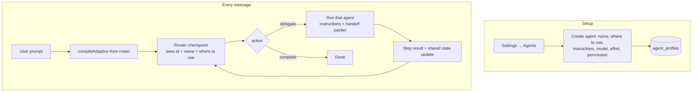
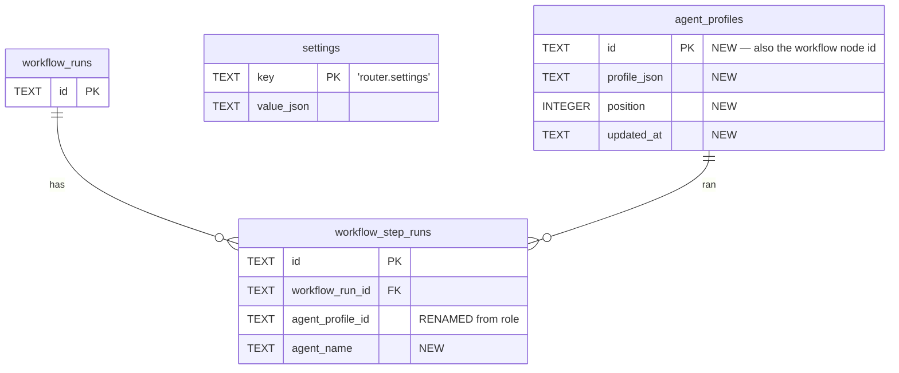

# PRD — User-created agents replace fixed roles

**Status**: Draft
**Created**: 2026-07-30
**Applies to**: Waing v0.1.0, in development
**Migration policy**: none — fresh start, no data to preserve

---

## 1. Summary

Waing today ships 8 hardcoded workflow roles. The user can only choose which provider runs each fixed row.
This replaces the fixed role set with **agents the user creates**: a name, a short "where to use" line, longer
instructions, a model (which also picks the CLI), an effort, and a permission profile. The router becomes the
only fixed component — it reads the agent roster and decides who takes each step.

---

## 2. Problem

**Today.** Settings → "Roles & routing" shows 8 immovable rows: `router`, `planning`, `low`, `medium`, `high`,
`review`, `bugfix`, `document`. The user picks a provider/model/effort/permission per row and nothing else.
`low` / `medium` / `high` are complexity guesses, not jobs — the router must force every task into three
buckets that mean nothing to the user. There is no way to add a "Test Writer", a "Migration Specialist", or a
"Flutter Reviewer", and no way to tell an agent *how* to work: `RoleExecutionProfile.instructions` exists in
the domain and is already injected into the step prompt by `StepExecutor.prompt()` (line 125), but no UI ever
sets it.

**Cost.** The product's value is orchestrating several CLIs well, and the orchestration vocabulary is fixed at
compile time. Every new kind of work needs a code change: a new enum member in `workflowRoleSchema`, a new
action in `workflowNextActionKindSchema`, a new node and edges in `WorkflowCompiler`, a new row in the
settings grid. Users cannot shape the system to their own workflow at all.

---

## 3. Solution

Three pillars:

1. **Agents are data, not code.** A row in `agent_profiles`, created and deleted from Settings.
2. **The router routes by job description, not by tier.** It sees each agent's name and one short "where to
   use" line — nothing else — and picks who runs next.
3. **The workflow graph is compiled from the roster at run time**, so adding an agent adds a route with no
   code change.

```
Name      | Where to use              | Model                  | Effort | Permission
----------|---------------------------|------------------------|--------|------------
Planner   | plan the tasks            | Opus 5 · Claude        | High   | Read only
Coder     | write the code            | gpt-5.6-codex · Codex  | Medium | Auto edit
Reviewer  | check finished work       | Opus 5 · Claude        | High   | Read only
```

---

## 4. Objectives

| # | Objective | Success metric |
|---|---|---|
| O1 | User can create, edit, delete agents | Full CRUD in Settings → Agents, no code change needed |
| O2 | Router picks by job, not complexity tier | `low`/`medium`/`high` gone; routing decision names an agent by id |
| O3 | Instructions are usable without confusing the router | Router sees ≤200 chars per agent; agent receives up to 4000 |
| O4 | Clear provider, model, and effort selection | Separate dependent Provider → Model → Effort controls |
| O5 | Adding an agent costs zero code | `compileAdaptive(profiles)` builds the graph from the roster |

---

## 5. Scope

### In scope

**Agent CRUD**
- New table `agent_profiles (id, profile_json, position, updated_at)`.
- Fields: `id`, `name` (≤40), `whereToUse` (≤200), `instructions` (≤4000, optional), `enabled`, `agentId`,
  `modelId?`, `effort?`, `permissionProfileId?`, `timeoutMs?`, `maxRetries?`, `position`.
- Settings → **Agents** page: router card, agent list, inline editor, create, delete, reorder.

**Router**
- Decision becomes `{ action: "delegate" | "ask_user" | "complete", agentProfileId? }`.
- Checkpoint carries `availableAgents: [{ id, name, whereToUse }]` — no provider or model, preserving the
  existing provider-neutral-router invariant.
- Router settings (`agentId`, `modelId`) live in the `settings` key/value table under `"router.settings"`.

**Model selection**
- Separate Provider, Model, and Effort selects. Changing provider refreshes models and clears incompatible downstream values.
- A "(provider default)" row per group = pick the CLI, leave the model to it.
- Effort options derive from the selected model's `effortLevels`; the control is disabled where
  `capabilities.effortControl` is false.

**Workflow**
- `compileAdaptive(profiles)` emits: `router` → one `role_task` per enabled agent → `work-loop` → `route-next`
  → `complete`. Node id = profile id, label = profile name.
- New edge condition `{ type: "router_agent", agentProfileId }`.

**Seeding**
- Five starter agents on an empty database (below). Nothing is carried over from the old tables.

### Out of scope

- Per-project agents — agents are global, like today's settings.
- Explicit agent pick in the composer; chat stays `agentId: "auto"`.
- A visual workflow builder.
- Sharing / importing / exporting agent definitions.
- Real provider system prompts. `instructions` continues to ride in the user message via
  `StepExecutor.prompt()`; no adapter currently accepts a system prompt and adding one is a separate change.

### Deferred

| Item | Reason | Phase |
|---|---|---|
| Per-project agent overrides | Global is enough to validate the model | v2 |
| Agent presets / marketplace | Needs the core model settled first | v2 |
| `systemPrompt` on `AgentRequest` + capability gate | Touches all four adapters; independent value | v2 |
| Reordering by drag | `position` is stored; buttons suffice for v1 | v2 |

### Consequences accepted

- **No agent type/kind field.** `review_gate` and `document` node types therefore have no producer. The
  structured review verdict, findings, PRD artifacts, and the review→fix loop are **deleted**. The router
  judges "more work or done" from `sharedState.planItems` / `openQuestions`, which its prompt already names as
  the primary signal.
- **Plan mode is gone** as a router action. A Planner agent is `read_only` + instructions saying "plan, don't
  edit". Arguably stronger: `read_only` is enforced by `PermissionManager`, while `mode: "plan"` is advisory
  and ignored outright by Codex and OpenCode.

### Target users

| User | What changes |
|---|---|
| Solo dev running several CLIs | Names their own agents and points each at the CLI that is actually good at that job |
| User with one CLI | Still gets 5 sensible agents on first launch; can trim to one |
| Contributor | Adding a new kind of step no longer means touching 6 files and 3 enums |

---

## 6. Architecture

### Run flow



The router is re-consulted after every step, bounded by `ADAPTIVE_MAX_ITERATIONS` (20) and the existing
oscillation guards in `WorkflowEngine.enforceRouterSafety`.

### Data model



Dropped outright: `workflow_role_profiles`, `routing_rules`, `routing_decisions`, `workflow_reviews`,
`workflow_findings`, `workflow_artifacts`.

### Domain shape

New `packages/domain/src/agents.ts`:

```ts
export const agentProfileSchema = z.object({
  id: z.string().min(1),
  name: z.string().min(1).max(40),
  whereToUse: z.string().min(1).max(200),          // the ONLY agent text the router sees
  instructions: z.string().max(4_000).optional(),  // only the agent sees this
  enabled: z.boolean(),
  agentId: z.string().min(1),                      // the CLI, set by the provider control
  modelId: z.string().min(1).optional(),           // undefined = that CLI's default
  effort: effortLevelSchema.optional(),
  permissionProfileId: z.string().min(1).optional(),
  timeoutMs: z.number().int().positive().optional(),
  maxRetries: z.number().int().min(0).max(10).optional(),
  position: z.number().int().min(0),
}).strict();

export const routerSettingsSchema = z.object({
  agentId: z.string().min(1), modelId: z.string().min(1).optional(),
}).strict();
```

Router contract in `packages/domain/src/workflow.ts`:

```ts
export const routerActionSchema = z.enum(["delegate", "ask_user", "complete"]);

export const routerOrchestrationDecisionSchema = z.object({
  action: routerActionSchema,
  agentProfileId: z.string().min(1).optional(),   // required when action === "delegate"
  effortHint: effortLevelSchema.optional(),
  statusIntent: stepAnnouncementIntentSchema,
  rationale: z.string().min(1), confidence: z.number().min(0).max(1),
}).strict().superRefine(/* delegate requires agentProfileId */);
```

`routerCheckpointInputSchema` gains
`availableAgents: z.array(z.object({ id, name, whereToUse }).strict()).min(1)` and loses `latestReview`,
`latestArtifact`, `artifacts`, `unresolvedIssues`, `reviewIteration`.

Node types reduce to `router`, `role_task`, `loop`, `complete`. Edge conditions reduce to `always`,
`router_agent`, `router_action` (only `complete`), `loop_remaining`, `loop_exhausted`.

---

## 7. Model selection — and how the CLI is chosen

**Provider is chosen first.** Its `AgentModelDescriptor` catalog then supplies the Model select. This keeps identical
underlying models on different CLIs unambiguous and makes the dependency between provider capabilities, model, and
effort visible.

| CLI | Source | Model ids look like | Effort |
|---|---|---|---|
| Codex | `model/list` JSON-RPC (`CodexAdapter.ts:104`) | `gpt-5.6-codex` | per-model, from `supportedReasoningEfforts` |
| Claude | hardcoded aliases (`ClaudeAdapter.ts:74`) | `sonnet`, `opus`, `haiku` | all four |
| Antigravity | parses `agy models` stdout (`AntigravityAdapter.ts:74`) | whatever `agy` prints | all four; `max` maps to `high` |
| OpenCode | loopback HTTP (`OpenCodeAdapter.ts:67`) | `anthropic/claude-opus-5` (`providerId/modelId`) | **none** — `effortControl: false` |

Control behaviour:

- Provider is a native select ordered as `agents.list()` returns; unavailable providers render disabled.
- Model is a second native select scoped to the chosen provider and led by **"Provider default"**.
- Changing Provider clears Model and resets Effort; changing Model normalizes Effort to that model's supported values.
- Antigravity's literal placeholder `modelId: "default"` never appears as a real model choice or reaches the adapter.
- Loading reuses `window.waing.agents.models(agentId)` with a per-provider promise cache. **No new IPC channel.**
- Every agent row shows `Opus 5 · Claude`, so the CLI is never hidden.

**Effort follows the model.** Today `EFFORT_OPTIONS` is a static four-item list, wrong for OpenCode and for
Codex models with a narrower set. Derive it from the selected model's `effortLevels`, and disable the control
with an explanatory `title` when `capabilities.effortControl` is false.

---

## 8. Codebase baseline

| Asset | Today | This change |
|---|---|---|
| `workflowRoleSchema` | 8-member enum, referenced across domain/workflow/persistence/UI | Deleted; `packages/domain/src/routing.ts` disappears entirely |
| `RoleExecutionProfile` | fixed `role`, unused `instructions` | → `AgentProfile`; `instructions` becomes a first-class UI field |
| `workflowNextActionKindSchema` | 11 fixed actions | → 3-member `routerActionSchema` + `agentProfileId` |
| `WorkflowCompiler` | 5 presets, 4 of them dead | One `compileAdaptive(profiles)` |
| `ProfileResolver` | 3-level override chain (global → workflow → step) | Flat `Map<id, AgentProfile>` lookup |
| `router:preview`, `workflows:run` IPC | **Verified unused** — neither `window.waing.router` nor `window.waing.workflows.run` appears in the renderer or e2e | Deleted |
| `RoleProfileGrid.tsx` | fixed 8-row table | Deleted; dependent provider/model/effort controls replace it |
| `docs/plan.md` §19.1, §19.2, §28 | Specifies the 8 roles | Rewritten around agents |

**Highest-risk mechanical task**: the `role` → `agentProfileId` rename touches `workflowStepResultSchema`,
`stepSummaryEntrySchema`, `stepAnnouncementSchema`, `routerDecisionRecordSchema`, `SqliteWorkflowRepository`,
`ContextCompactor`, `AnnouncementRenderer`, and the renderer. `npm run check` surfaces every site as a type
error — that is the gate, not manual review.

---

## 9. Component inventory

| Layer | New | Deleted |
|---|---|---|
| `@waing/domain` | `src/agents.ts` (`agentProfileSchema`, `routerSettingsSchema`), `routerActionSchema` | `src/routing.ts` (whole file), `roleExecutionProfileSchema`, `stepExecutionOverrideSchema`, `reviewGateNodeSchema`, `documentNodeSchema`, `reviewResultSchema`, `reviewFindingSchema`, `fixPacketSchema`, `workflowArtifactRefSchema`, `documentTaskInputSchema`, `reviewFixLoopPolicySchema`, events `workflow.review.completed` / `workflow.artifact.created` |
| `@waing/router` | roster rendering in `buildOrchestrationPrompt`; `agentProfileId ∈ availableAgents` check in `decideNext` | `ROUTING_SYSTEM_PROMPT`, `buildRoutingPrompt`, `RouterManager.classify/resolve/route/safestRole`, `AutoSelector` |
| `@waing/workflow` | `AgentProfileDefaults.ts` (`buildStarterAgentProfiles`), `WorkflowCompiler.compileAdaptive` | `RoleProfileDefaults.ts`, 4 presets, `actionRoles`, `enforceCompletionGates`, `edgeForReview`, `fixPacket`, `documentInput`, `latestReview`, `StepExecutor.parseReview` |
| `@waing/persistence` | `listAgentProfiles`, `saveAgentProfile`, `removeAgentProfile` | `saveRoleProfile`, `listRoleProfiles`, `saveRoutingRule`, `saveRoutingDecision`, 6 tables |
| `@waing/ipc-contracts` | `agentSettingsInputSchema`, `AgentSettingsView`, `settings:agents:{get,save,acknowledge}` | `roleProfilesInputSchema`, `workflowRunInputSchema`, `RoleProfilesView`, `SessionSendResult.routing`, `router:preview`, `workflows:run` |
| renderer | `AgentsSettings.tsx`, dependent Provider/Model/Effort controls | `RoleProfileGrid.tsx`, the `workflow.review.completed` handler (`App.tsx:207-209`) |

---

## 10. UX specification

### Settings → Agents

**Router card** (top). Provider, Model, and Effort controls using the same interaction as an agent editor.

**Agent list.** One row per agent: `Name | Where to use | Model · CLI | Effort | Permission`, plus Edit and
Delete. Delete uses the inline-confirm pattern from `App.tsx:568-572` — there are **no modals anywhere in this
app**; do not introduce one.

**Editor.** An inline expanding card, not a dialog:

```
Name          [ Planner                                   ]
Where to use  [ plan the tasks                            ]  14/200
              ↳ This is the only text the router reads. Keep it one line.
Instructions  [ Read the request and the relevant files.  ]
              [ Produce a numbered plan. Do not edit any  ]
              [ file.                                     ]
Model         [ Opus 5 · Claude                        ▼ ]
Effort        [ High                                   ▼ ]
Permission    [ Read only                              ▼ ]
```

**Saving.** Reuse the existing debounced autosave from `SettingsPanel.tsx:43-58` (400 ms, `saveRevision` ref,
`aria-live` status, Retry on error). Whole-list save covers create / edit / delete / reorder with no extra
channels.

**Validation.** At least one enabled agent; unique ids; `name` and `whereToUse` non-empty.

### Chat

- Composer unchanged (`agentId: "auto"`).
- Timeline reads "Routed to Coder" instead of "Routed to medium".
- Banner copy: "Waing is using starter agents built from your installed providers."

---

## 11. Starter agents

Emitted by `buildStarterAgentProfiles(descriptors)` when `agent_profiles` is empty. Each is assigned an
installed CLI by the same preference-list approach `buildDefaultRoleProfiles` uses today, with `modelId`
undefined so it starts on that CLI's default.

| Name | Where to use | Effort | Permission |
|---|---|---|---|
| Planner | Break a broad or unclear request into concrete steps before any code is written. | High | Read only |
| Coder | Write and change code — the default for ordinary implementation work. | Medium | Auto edit |
| Architect | Large, risky, or cross-cutting changes needing careful reasoning. | High | Ask changes |
| Reviewer | Check finished work for bugs, regressions, security issues, and missing tests. | High | Read only |
| Doc Writer | Write or update README, PRD, changelog, or architecture notes. | Medium | Auto edit |

Five, not seven: `low`/`medium`/`high` were complexity tiers, and the point of this change is that the router
routes by job. "Quick Fix" and "Bug Fixer" are agents a user adds if they want them.

`router.settings` seeds to the first available CLI in the order the router already prefers (`opencode`,
`codex`, `claude`, `antigravity`), with no model.

---

## 12. Implementation

### Phase 1 — Domain and contracts
- [ ] Add `packages/domain/src/agents.ts` with `agentProfileSchema` and `routerSettingsSchema`; export both.
- [ ] Delete `packages/domain/src/routing.ts` and every re-export of it.
- [ ] Replace `workflowNextActionKindSchema` with `routerActionSchema`; rewrite
      `routerOrchestrationDecisionSchema` and `routerCheckpointInputSchema`.
- [ ] Reduce `workflowNodeSchema` to `router | role_task | loop | complete`; `role` → `agentProfileId`.
- [ ] Rename `role` → `agentProfileId` + `agentName` on `workflowStepResultSchema`, `stepSummaryEntrySchema`,
      `stepAnnouncementSchema`, `routerDecisionRecordSchema`.
- [ ] Delete the review / document / artifact schemas and the two dead events.

### Phase 2 — Router
- [ ] Delete `ROUTING_SYSTEM_PROMPT`, `buildRoutingPrompt`, `RouterManager.classify/resolve/route/safestRole`,
      `AutoSelector`.
- [ ] Rewrite `ORCHESTRATION_SYSTEM_PROMPT` around delegation; render the roster in `buildOrchestrationPrompt`:
      `- id=<uuid> | Planner | use when: plan the tasks`.
- [ ] Add the `agentProfileId ∈ availableAgents` check next to the existing `allowedActions` check.
- [ ] Strip `agentId` / `modelId` from `latestStepResult` in `compactCheckpoint` — an existing leak of provider
      identity into the router prompt.

### Phase 3 — Workflow engine
- [ ] `RoleProfileDefaults.ts` → `AgentProfileDefaults.ts` with `buildStarterAgentProfiles(descriptors)`.
- [ ] Collapse `ProfileResolver` to a `Map<string, AgentProfile>` lookup.
- [ ] `WorkflowCompiler` → single `compileAdaptive(profiles)`; delete the other 4 presets and their helpers.
- [ ] `WorkflowEngine`: delete `actionRoles`, `enforceCompletionGates`, `edgeForReview`, `fixPacket`,
      `documentInput`, `latestReview` and the review/document branches; resolve `agentProfileId` via a
      `router_agent` edge; populate `handoff.currentDiff` for **every** step (a user's Reviewer agent needs it
      and there is no longer a node type signalling "this one reviews").
- [ ] `StepExecutor`: `profile: AgentProfile`; delete `parseReview` and the review/document/fix sections;
      `defaultMode()` → `"execute"`.
- [ ] `AnnouncementRenderer`: activity from `statusIntent`, falling back to `implementing`.

### Phase 4 — Persistence
- [ ] **Rewrite migration v1 in place** — a deliberate one-time exception to the "never edit an applied
      migration" rule in `CLAUDE.md`, valid only because there is no shipped data. The rule resumes after this
      lands.
- [ ] Add `agent_profiles`; drop `workflow_role_profiles`, `routing_rules`, `routing_decisions`,
      `workflow_reviews`, `workflow_findings`, `workflow_artifacts`.
- [ ] `workflow_step_runs.role` → `agent_profile_id`, add `agent_name`.
- [ ] `PersistenceStore`: add `listAgentProfiles` / `saveAgentProfile` / `removeAgentProfile`; delete the four
      dead methods.

### Phase 5 — IPC and main
- [ ] Rename `settings:roles:*` → `settings:agents:*`; delete `router:preview` and `workflows:run`.
- [ ] Add `agentSettingsInputSchema` and `AgentSettingsView`; update `DesktopApi` and the preload bridge.
- [ ] `resolveRoleProfiles()` → `resolveAgentProfiles()`; `assertRolesUsable` → `assertAgentsUsable`.
- [ ] `runChatWorkflow` uses `compileAdaptive(profiles)`.
- [ ] `settings:agents:save`: unique ids, ≥1 enabled, replace the stored set, set `routing.configured`.
- [ ] **`WAING_E2E=1` branch**: seed 3 fake-CLI agents and return
      `{ action: "delegate", agentProfileId: <Coder id> }`. `CLAUDE.md` flags this branch explicitly — it
      drifts silently otherwise.

### Phase 6 — Renderer
- [ ] Add native dependent Provider, Model, and Effort controls with cached provider model loading.
- [ ] Build `AgentsSettings.tsx` (router card, list, inline editor, create, delete-with-inline-confirm).
- [ ] `SettingsPanel.tsx`: section `"routing"` → `"agents"`, label → "Agents", icon → `Bot`, keywords updated.
- [ ] `App.tsx`: banner copy, delete the `workflow.review.completed` handler, read `agentName` on
      `workflow.route.selected`.
- [ ] `styles.css`: replace `.role-table*` with `.agent-row` / `.agent-editor` and native select styling.
      Match the existing packed-line density.

### Phase 7 — Tests and docs
- [ ] Update `RouterManager.test.ts`, `AgentRouterClient.test.ts`, `Workflow.test.ts`, `StepExecutor.test.ts`,
      `ContextCompactor.test.ts`, `Persistence.test.ts`, `domain/index.test.ts`.
- [ ] `RoleProfileDefaults.test.ts` → `AgentProfileDefaults.test.ts`.
- [ ] `apps/desktop/tests/smoke.spec.ts`: line 85 `"Routed to medium"`, lines 155-168 the Roles & routing
      section. Note line 160 already asserts a `"Planning mode"` combobox that does not exist today — that spec
      is stale before this change.
- [ ] New: router rejects an `agentProfileId` outside `availableAgents`; `compileAdaptive` is valid for 1 agent
      and for 15; seeding assigns only installed CLIs; saving zero enabled agents is rejected; the model
      control never stores Antigravity's `"default"` placeholder as a real `modelId`.
- [ ] Rewrite `README.md` (flow diagram lines 18-28, Configuration bullet 66-68) and `docs/plan.md` §19.1,
      §19.2, §28.

---

## 13. Security

| Concern | Mitigation |
|---|---|
| Renderer sends an arbitrary agent definition | `agentSettingsInputSchema.parse()` after `assertTrustedIpc(event)` in every handler, per the existing pattern |
| A user names an agent to impersonate a CLI ("Claude") | Only `id` / `name` / `whereToUse` reach the router; provider identity is never in the prompt, and `stepAnnouncementIntentSchema` still rejects vendor names in router-authored templates |
| `instructions` used to escalate beyond the permission profile | Permissions are enforced by `PermissionManager` at the tool-call boundary, not by prompt text; `read_only` denies writes regardless of what the instructions say |
| Provider identity leaking into the router prompt | Fixed as part of Phase 2 — `latestStepResult.agentId` / `.modelId` stripped in `compactCheckpoint` |
| Workspace escape via a crafted agent | Unchanged: `canonicalizeWorkspaceRoot` / `resolveWorkspacePath` still gate every path, and there is still no generic fs/shell channel |
| Secrets in stored instructions | `redactSensitiveData` already runs on every normalized event before persistence and renderer delivery |

---

## 14. Testing

```bash
npm run check                                        # typecheck + lint + unit + build — the gate
npx vitest run packages/workflow packages/router packages/domain
npx vitest run packages/persistence
npm run build && npm run test:e2e
```

**Manual verification** (`npm run dev`):

0. Delete the existing dev database first — migration v1 is rewritten in place, so a database created by the
   old v1 will not re-run it. It lives under Electron `userData` (`~/Library/Application Support/Waing/`).
1. Settings → Agents shows 5 starter agents + the router card, each on an installed CLI.
2. The Model picker lists Codex, Claude, Antigravity, and OpenCode under CLI headers, each group led by
   "(provider default)". Searching `opus` finds it under both Claude and OpenCode.
3. Pick an OpenCode model → Effort is disabled with an explanation. Pick a Codex model → Effort offers only
   that model's supported levels.
4. Point an agent at Antigravity when `agy models` fails → it stores the CLI default, not the literal string
   `"default"`, and the run still starts.
5. Create "Test Writer", where to use: "Write or extend unit tests for code that already exists".
6. Send "add unit tests for the compactor" → the timeline announces **Test Writer**.
7. Send "plan it, then build it" → Planner runs, then Coder, without a second prompt.
8. Delete an agent; the next run's roster no longer offers it.
9. Delete every agent → save is rejected with a clear message.
10. Set an agent to `read_only`; a write raises the permission card.

---

## 15. Risks

| Risk | Likelihood | Mitigation |
|---|---|---|
| Router picks badly when several agents have similar "where to use" text | Medium | 200-char cap forces distinctness; the editor hint says one line; `rationale` is shown in the timeline so a bad pick is visible and diagnosable |
| A user writes a vague "where to use" and routing degrades | Medium | Starter agents model good phrasing; a future v2 can lint for near-duplicates |
| Losing the review→fix loop weakens multi-step quality | Medium | `sharedState.planItems` / `openQuestions` already carry the "is anything left" signal and the router prompt already leans on them; a user-made Reviewer agent still runs, now with the diff in every handoff |
| A 15-agent roster bloats every router call | Low | One line per agent, capped at 200 chars ≈ 3k chars at 15 agents, well inside the existing 1200-char-per-summary compaction budget |
| The `role` rename misses a call site | Low | Types are strict with `noUncheckedIndexedAccess`; `npm run check` fails on any miss |
| E2E drifts because the `WAING_E2E` branch was not updated | Medium | Called out explicitly in `CLAUDE.md` and as a Phase 5 checklist item |

---

## 16. Definition of done

- [ ] Agents can be created, edited, reordered, and deleted from Settings with no restart.
- [ ] A newly created agent is routable on the very next message, with no code change.
- [ ] Provider selection scopes the model list; effort follows the selected model.
- [ ] `grep -r "WorkflowRole\|execute_low\|execute_medium\|execute_high"` returns nothing outside docs.
- [ ] `npm run check` green.
- [ ] `npm run test:e2e` green against the rebuilt app.
- [ ] `README.md` and `docs/plan.md` describe agents, not roles.
- [ ] Manual verification steps 1-10 pass.

---

_Last updated: July 30, 2026_
